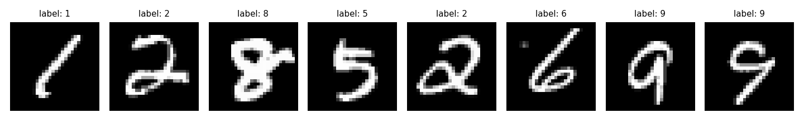
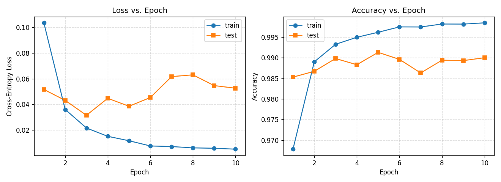
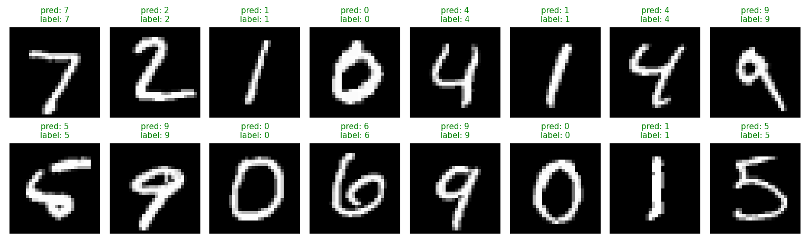
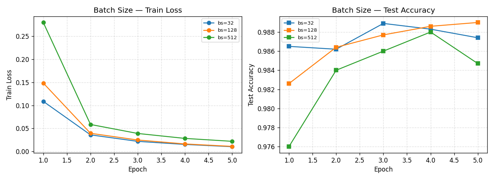
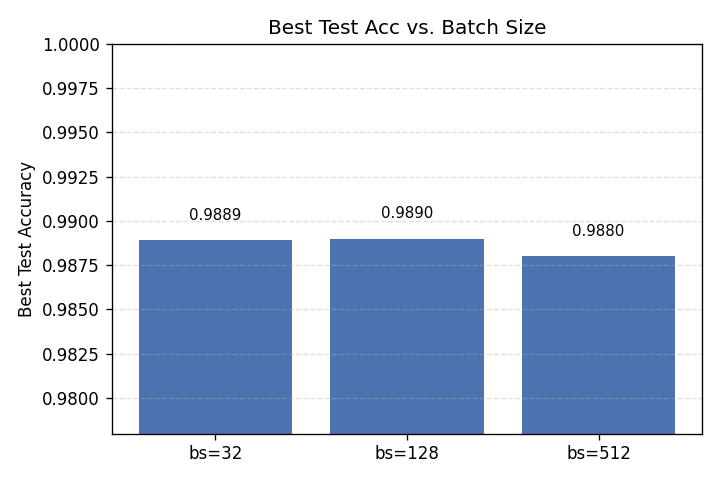
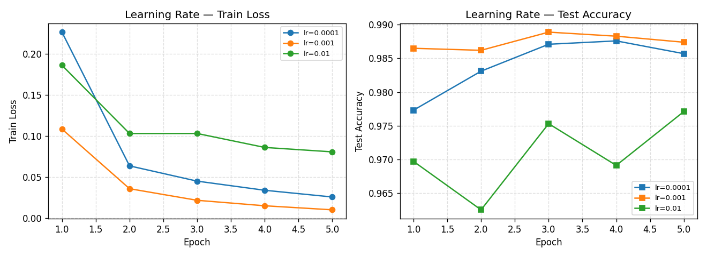
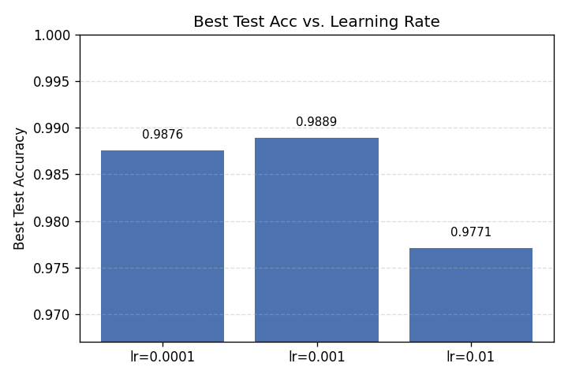
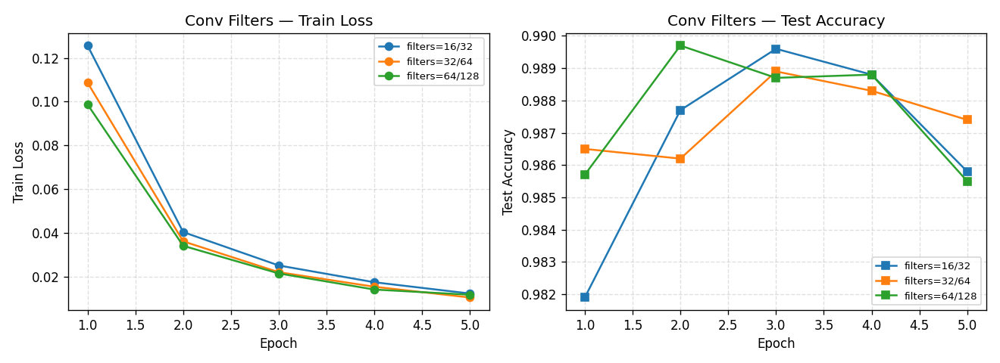
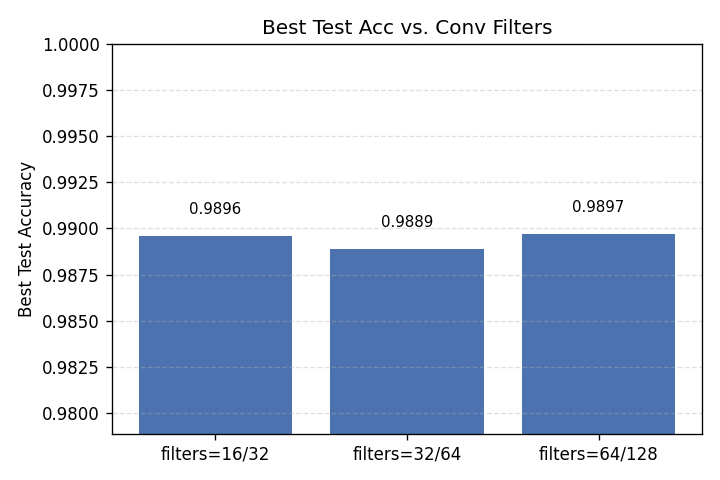

# 人工智能导论 · 上机实验 3 报告

> **题目：** 基于 PyTorch 的卷积神经网络（CNN）识别 MNIST 数据集

## 一、实验目的

本次实验的核心目标是在 PyTorch 框架下实现用于手写数字识别的卷积神经网络（CNN），并系统地体会卷积层、池化层与全连接层在整个识别流水线中的作用。在此基础上，通过完整地执行「前向传播 → 损失计算 → 反向传播 → 参数更新」的标准训练流程，进一步加深对深度学习中梯度优化机制的理解。本实验还要求在测试集上达到 90% 以上的识别准确率，并对批大小（batch size）、学习率（learning rate）与卷积核数量（conv_filters）三个关键超参数进行敏感度分析，从而为模型的调优提供实验依据。

## 二、实验环境

| 项目 | 说明 |
|:--|:--|
| 操作系统 | macOS 15 (Darwin 24.6.0) |
| 编程语言 | Python 3.14 |
| 深度学习框架 | PyTorch 2.11.0 |
| 辅助库 | torchvision 0.26、matplotlib、numpy |
| 计算设备 | Apple Silicon GPU（通过 PyTorch MPS 后端） |

源代码位于 [src/cnn-mnist-pytorch.py](../src/cnn-mnist-pytorch.py)，本次实验的全部训练、评估与可视化均由该脚本一次性完成。

## 三、实验原理

### 3.1 MNIST 数据集

MNIST 是手写数字识别的经典基准数据集，由 60000 张训练图像与 10000 张测试图像构成，每张图像为 $28 \times 28$ 的单通道灰度图，对应 $0\text{–}9$ 共 10 个类别。样本规模适中、类别分布均衡，这使其成为入门级图像分类任务的标准数据集。本实验直接使用项目目录下预先准备好的 idx 原始二进制文件，并通过 `torchvision.datasets.MNIST` 完成加载。

### 3.2 卷积神经网络（CNN）

卷积神经网络通过**局部感受野**与**权值共享**两大机制，相较于多层感知机（MLP）能够更高效地利用图像的二维空间结构。一个典型的 CNN 分类器由卷积层、池化层与全连接层三类组件构成。

**卷积层**使用若干个尺寸为 $K \times K$ 的卷积核在输入特征图上滑动，从而抽取局部特征；每个卷积核对应一个输出通道，并在整张图上共享权重。给定输入特征图尺寸 $H_{in}$、填充 $P$、卷积核大小 $K$、步长 $S$，输出尺寸满足：

$$
H_{out} = \left\lfloor \frac{H_{in} + 2P - K}{S} \right\rfloor + 1
$$

**池化层**（本实验采用 $2 \times 2$ 最大池化）对特征图进行下采样，一方面能够降低特征图的空间分辨率、压缩参数规模，另一方面为模型引入一定的平移不变性与对噪声的鲁棒性。**全连接层**位于网络末端，负责将高层特征映射到类别空间，对应分类决策的「读出层」。

本实验采用的网络结构 `SimpleCNN` 定义如下（默认 `conv1_out=32, conv2_out=64`）：

$$
\underbrace{[\,1\times 28\times 28\,]}_{\text{输入}}
\xrightarrow{\text{Conv}(3\times3)+\mathrm{ReLU}}
[\,32\times 26\times 26\,]
\xrightarrow{\text{Conv}(3\times3)+\mathrm{ReLU}}
[\,64\times 24\times 24\,]
\xrightarrow{\text{MaxPool}\,2\times2}
[\,64\times 12\times 12\,]
$$

随后将特征图展平为 $64 \times 12 \times 12 = 9216$ 维向量，依次经过 $Linear(9216 \to 128) + \text{ReLU}$ 与 $Linear(128 \to 10)$ 输出 10 维 logits。整个网络的可学习参数总数约为 **1,199,882**。

### 3.3 ReLU 激活函数

本实验在所有非线性层处使用 ReLU：

$$
\mathrm{ReLU}(x) = \max(0, x)
$$

相较于 Sigmoid 与 Tanh，ReLU 计算开销更小，且在正区间上梯度恒为 1，从而显著缓解了深层网络中的梯度消失问题。

### 3.4 Softmax 与交叉熵损失

对于多分类任务，网络的原始输出（logits）$\mathbf{z} \in \mathbb{R}^{K}$ 通常需要经过 Softmax 映射为概率分布：

$$
\mathrm{softmax}(\mathbf{z})_i = \frac{e^{z_i}}{\sum_{k=1}^{K} e^{z_k}}
$$

Softmax 保证了输出各分量均为非负且总和为 1，从而可以解释为类别的条件概率估计。随后采用**交叉熵损失**（Cross-Entropy Loss）衡量预测分布与真实标签之间的差异：

$$
\mathcal{L} = -\log \frac{e^{z_y}}{\sum_{k=1}^{K} e^{z_k}}
$$

其中 $y$ 为真实类别索引。值得注意的是，PyTorch 的 `nn.CrossEntropyLoss` 内部已经将 `LogSoftmax` 与 `NLLLoss` 组合为一个数值稳定的运算，因此网络的最后一层**不需要**再显式添加 Softmax，直接输出 logits 即可。

### 3.5 Adam 优化器

Adam（Adaptive Moment Estimation）结合了动量法与 RMSProp 的自适应学习率思想，对每个参数维度自动维护一阶矩估计与二阶矩估计，在实际训练中对学习率的选择相对不敏感、收敛也更快。本实验默认使用 $\text{lr} = 10^{-3}$。

## 四、实验步骤与代码实现

完整实现见 [src/cnn-mnist-pytorch.py](../src/cnn-mnist-pytorch.py)。本节摘录其中的关键片段以便说明。

### 4.1 设备选择与随机种子

```python
torch.manual_seed(42)
np.random.seed(42)

def select_device() -> torch.device:
    if torch.cuda.is_available():
        return torch.device("cuda")
    if torch.backends.mps.is_available():
        return torch.device("mps")
    return torch.device("cpu")
```

按 `cuda → mps → cpu` 的优先级自动选择计算设备，使脚本可在不同硬件环境下直接运行。本机最终选用 MPS 后端。

### 4.2 数据加载与预处理

原始 MNIST 图像在送入网络之前需要经过两步处理：首先通过 `ToTensor()` 将 PIL 图像转换为 $[0, 1]$ 区间上的 Tensor；随后调用 `Normalize` 按 MNIST 训练集的经验统计量 $(\mu=0.1307, \sigma=0.3081)$ 进行标准化。标准化后数据分布以零为中心、尺度较为统一，能够避免输入量级不平衡所导致的梯度失衡，使训练更加稳定。

```python
transform = transforms.Compose([
    transforms.ToTensor(),
    transforms.Normalize((0.1307,), (0.3081,)),
])

train_set = torchvision.datasets.MNIST(root=DATA_ROOT, train=True,
                                       download=need_download, transform=transform)
test_set  = torchvision.datasets.MNIST(root=DATA_ROOT, train=False,
                                       download=need_download, transform=transform)
```

随机采样一小批训练图像进行可视化，以直观感受数据质量：



### 4.3 定义 SimpleCNN 网络结构

```python
class SimpleCNN(nn.Module):
    def __init__(self, conv1_out=32, conv2_out=64, fc_hidden=128, num_classes=10):
        super().__init__()
        self.conv1 = nn.Conv2d(1, conv1_out, kernel_size=3)
        self.conv2 = nn.Conv2d(conv1_out, conv2_out, kernel_size=3)
        self.pool  = nn.MaxPool2d(kernel_size=2, stride=2)
        self.flatten_dim = conv2_out * 12 * 12     # 28 -> 26 -> 24 -> 12
        self.fc1 = nn.Linear(self.flatten_dim, fc_hidden)
        self.fc2 = nn.Linear(fc_hidden, num_classes)

    def forward(self, x):
        x = F.relu(self.conv1(x))
        x = F.relu(self.conv2(x))
        x = self.pool(x)
        x = torch.flatten(x, start_dim=1)
        x = F.relu(self.fc1(x))
        return self.fc2(x)  # logits
```

### 4.4 损失函数与优化器

```python
criterion = nn.CrossEntropyLoss()
optimizer = optim.Adam(model.parameters(), lr=1e-3)
```

### 4.5 训练与评估

训练循环严格遵循「前向传播 → 计算损失 → 梯度清零 → 反向传播 → 参数更新」的五步范式。由于 PyTorch 的自动微分机制会在已有梯度上**累加**新的梯度，因此每次反向传播之前必须调用 `optimizer.zero_grad()` 将梯度清零，以避免相邻批次之间相互干扰。评估时则通过 `model.eval()` 切换到评估模式，并用 `@torch.no_grad()` 关闭梯度记录以减少内存占用并加快推理。

```python
def train_one_epoch(model, device, loader, optimizer, criterion):
    model.train()
    ...
    for X, y in loader:
        X, y = X.to(device), y.to(device)
        logits = model(X)                       # 1. 前向
        batch_loss = criterion(logits, y)       # 2. 计算损失
        optimizer.zero_grad()                   # 3. 梯度清零
        batch_loss.backward()                   # 4. 反向传播
        optimizer.step()                        # 5. 参数更新
        ...
```

### 4.6 超参数敏感度分析

实现了 `run_single_config` 工具函数：给定 `(batch_size, lr, conv1_out, conv2_out)`，该函数会重新设置随机种子、重建 DataLoader 与模型，并运行 5 个 epoch。三次独立的扫描分别对应批大小、学习率与卷积核数量三个维度的敏感度分析。

## 五、实验结果与分析

### 5.1 基线模型训练过程

在 `(batch_size=32, lr=1e-3, conv_filters=32/64)` 的基线配置下训练 10 个 epoch，全过程指标如下：

| Epoch | 训练损失 | 训练准确率 | 测试损失 | 测试准确率 |
|:-:|:-:|:-:|:-:|:-:|
| 1  | 0.1034 | 96.78% | 0.0516 | 98.53% |
| 2  | 0.0361 | 98.90% | 0.0431 | 98.67% |
| 3  | 0.0216 | 99.32% | 0.0315 | 98.98% |
| 4  | 0.0152 | 99.50% | 0.0447 | 98.83% |
| 5  | 0.0117 | 99.62% | 0.0385 | **99.13%** |
| 6  | 0.0077 | 99.75% | 0.0453 | 98.96% |
| 7  | 0.0072 | 99.74% | 0.0616 | 98.63% |
| 8  | 0.0062 | 99.82% | 0.0630 | 98.94% |
| 9  | 0.0059 | 99.81% | 0.0546 | 98.93% |
| 10 | 0.0052 | 99.84% | 0.0526 | 99.00% |

模型在第 5 个 epoch 取得了最佳测试准确率 **99.13%**，显著超过了教程所要求的 90% 这一基准线，也明显优于在同一数据集上训练的 MLP 模型（$\sim 97.9\%$），这印证了卷积神经网络在图像分类任务上的结构性优势。



从训练曲线中可以观察到两点。第一，模型的收敛非常迅速：仅经过 1 个 epoch，测试准确率就已经达到 98.53%，体现了 Adam 优化器在合适学习率下的高效性；训练损失随 epoch 持续单调下降，而训练准确率也快速趋近 100%。第二，测试损失在大约第 4 个 epoch 之后开始呈现微弱的上升趋势，而训练损失仍持续下降，两者形成了典型的「剪刀差」，这提示模型已经进入一定程度的过拟合阶段。测试准确率本身依然维持在 99% 上下，说明过拟合尚未严重影响泛化能力，但若继续增加训练轮数，应当考虑引入 Dropout、权重衰减（weight decay）或早停（early stopping）等正则化策略以进一步缓解这一现象。

### 5.2 预测结果可视化

从测试集中取一个 batch 的前 16 张图像，比较模型预测与真实标签。绿色标题表示预测正确，红色表示预测错误：



可视化结果显示，模型对于书写清晰的数字基本都能给出正确预测，这与全集上 99.13% 的测试准确率表现一致。

### 5.3 卷积层、池化层与 Softmax 的作用分析

从本次实验的结果看，**卷积层**的核心作用在于以局部感受野的方式抽取具有空间不变性的局部特征。第一层卷积主要学习到边缘、笔画走向等低级结构，第二层卷积则在此基础上组合出笔画的交叉与弯曲等更抽象的模式，这一层级化的表达正是 CNN 性能优于 MLP 的根本原因。**池化层**在本实验中以 $2 \times 2$ 最大池化的形式，将特征图的空间分辨率从 $24 \times 24$ 压缩到 $12 \times 12$，在有效降低计算开销的同时保留了最显著的激活值，并为模型提供了一定程度的平移不变性。**Softmax** 则位于分类管线的末端，将网络输出的 logits 归一化为合法的概率分布，使得模型能够以「类别概率」的形式给出预测；在训练过程中，其与交叉熵损失共同作用，为反向传播提供了平滑且数值稳定的梯度信号。

### 5.4 超参数敏感度分析（加分项）

在基线配置的基础上，分别沿批大小、学习率与卷积核数量三个方向进行扫描，每组配置训练 5 个 epoch，其余超参保持基线不变。

#### 5.4.1 批大小 batch_size

| batch_size | 5 epoch 内最佳测试准确率 |
|:-:|:-:|
| 32  | 98.89% |
| 128 | **98.90%** |
| 512 | 98.80% |




从曲线上可以看到，批大小为 32 时梯度噪声较大，第一步损失下降幅度最为明显，但随训练推进其测试曲线出现较多抖动；批大小为 128 时兼顾了梯度信噪比与单步更新效率，最终在 5 个 epoch 内达到最佳的 98.90% 测试准确率；批大小为 512 时则由于每个 epoch 中参数更新次数显著减少，收敛速度最慢、早期测试准确率明显偏低（97.60%）。总体而言，在本模型规模下，该超参在 $[32, 512]$ 区间内对最终精度的影响不超过 0.1%，属于**低敏感**超参数。

#### 5.4.2 学习率 learning_rate

| learning_rate | 5 epoch 内最佳测试准确率 |
|:-:|:-:|
| $1 \times 10^{-4}$ | 98.76% |
| $1 \times 10^{-3}$ | **98.89%** |
| $1 \times 10^{-2}$ | 97.71% |




学习率的影响明显更为剧烈。$1 \times 10^{-4}$ 过小，网络收敛缓慢，在 5 个 epoch 内仍未充分训练；$1 \times 10^{-3}$ 为公认的 Adam 默认值，能够在本任务上获得最快的下降曲线与最高的测试准确率；当学习率放大到 $1 \times 10^{-2}$ 时，训练损失曲线明显抖动，测试准确率始终稳定不住，直观体现了「优化步伐过大、在极小值附近来回震荡」这一现象。因此学习率属于**高敏感**超参数，需要谨慎选择。

#### 5.4.3 卷积核数量 conv_filters

| (conv1_out, conv2_out) | 5 epoch 内最佳测试准确率 |
|:-:|:-:|
| 16 / 32  | 98.96% |
| 32 / 64  | 98.89% |
| 64 / 128 | **98.97%** |




增大卷积核数量意味着每一层都能学习到更多不同模式的特征检测器。实验结果显示，$64/128$ 配置取得了 98.97% 的最佳精度，比 $32/64$ 的基线配置略高 0.08%；但这种提升十分有限，而模型参数量几乎翻了一倍，训练时间也显著增加。$16/32$ 配置在参数最少、训练最快的情况下依然取得了 98.96% 的高分，这说明在 MNIST 这一数据规模相对较小、任务较为简单的数据集上，模型容量在较小区间内即已饱和，盲目堆叠通道数所带来的边际收益很低。

#### 5.4.4 综合结论

综合三组扫描结果，本次实验所找到的**最优参数组合**为：

$$
(\text{batch\_size}=128,\; \text{lr}=10^{-3},\; \text{conv\_filters}=64/128)
$$

该组合在敏感度分析中均对应各自维度的最高测试准确率。同时这也验证了一个常见的深度学习经验：在多数情况下，学习率对最终性能的影响远大于批大小与模型宽度，调参时应当**优先把学习率调对**，然后再在模型容量与批大小之间寻找平衡。

## 六、思考与拓展

尽管本次实验取得了 99.13% 的测试准确率，依然有多个方向值得进一步探索。在**网络结构**方面，可以在现有基础上增加卷积层数，或在卷积块之间插入 BatchNorm 层以进一步稳定训练；也可以借鉴 LeNet-5、VGG 等经典架构，观察深度、宽度、卷积核尺寸等因素对性能的影响。在**正则化**方面，可以在全连接层之前引入 `nn.Dropout(p=0.25)` 或为 Adam 优化器设置 `weight_decay` 以施加 L2 正则，从而缓解前文所观察到的测试损失上翘现象。在**数据层面**，可以引入简单的数据增强（随机平移、旋转、弹性形变等），通过扩充训练分布进一步提升泛化能力。在**训练策略**方面，可以使用 `torch.optim.lr_scheduler.CosineAnnealingLR` 等学习率调度器替代固定学习率，或者对比 SGD+Momentum 与 Adam 的收敛行为，加深对优化器差异的理解。

## 七、实验总结

本次实验以 MNIST 手写数字识别任务为载体，系统地实践了 PyTorch 下卷积神经网络的完整训练流程：从数据加载与标准化、CNN 网络结构的设计（两卷积层 + 一次最大池化 + 两全连接层），到交叉熵损失与 Adam 优化器的组合，再到训练循环的实现与测试集评估。最终的 `SimpleCNN` 模型在 MNIST 测试集上取得了 **99.13%** 的最佳准确率，不仅远超实验所要求的 90% 阈值，也明显优于先前实验中训练的 MLP 模型的 97.9%，这直观地验证了卷积结构通过局部连接与权值共享高效利用图像空间信息的能力。

在加分项的超参数敏感度分析部分，通过对批大小、学习率与卷积核数量的系统扫描，获得了较为清晰的经验结论：学习率是对模型性能影响最大的超参数，批大小与卷积核数量在合理范围内均属于低敏感度变量；在本任务上，$(\text{batch\_size}=128,\ \text{lr}=10^{-3},\ \text{conv\_filters}=64/128)$ 为所观察到的最优组合。

通过本次实验，笔者进一步理解了卷积、池化与全连接层在 CNN 中各自承担的角色，也切身体会到合理选择损失函数、优化器与学习率对训练结果的决定性影响；同时，通过观察训练损失、测试损失与准确率三者之间的相对变化，对「欠拟合—充分拟合—过拟合」这一训练动态过程也有了更直观的认识，为后续学习更复杂的视觉模型（ResNet、Vision Transformer 等）打下了良好的基础。
