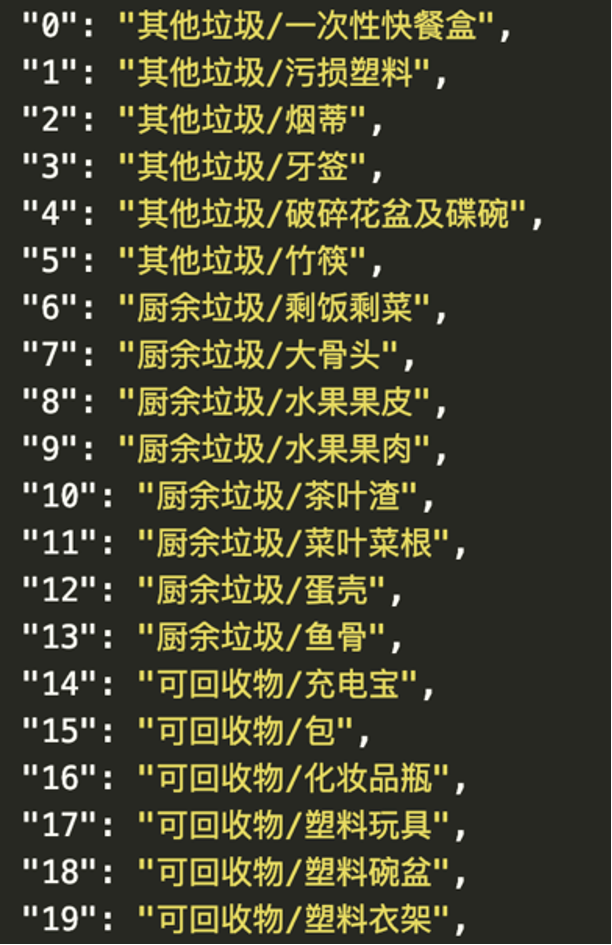
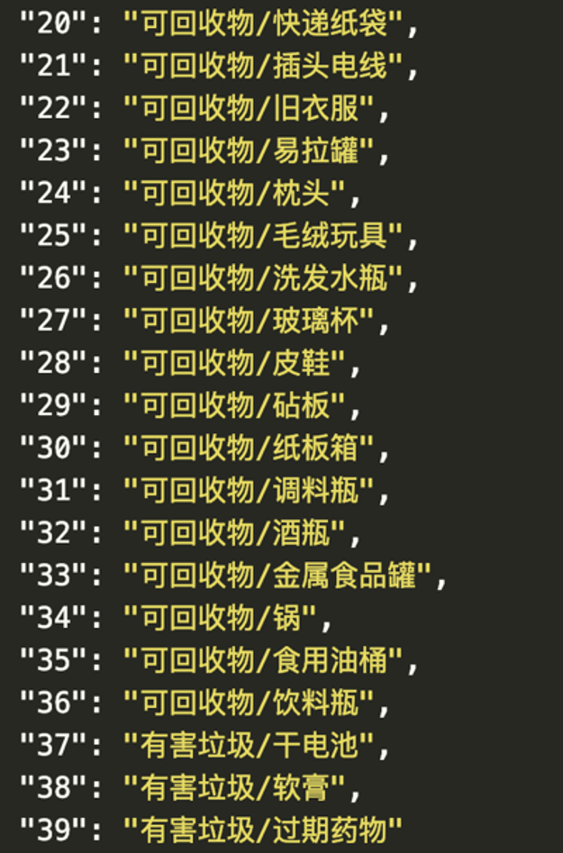

# 人工智能导论 · 上机实验 · 综合实践报告

> **题目：** 基于 PyTorch 与 EfficientNet-V2 迁移学习的生活垃圾图片 40 分类

## 一、实验目的

本次实验完成一次端到端的图像分类实战。具体目标包括：

1. 在 PyTorch 框架下，基于 ImageNet 预训练的 **EfficientNet-V2-S** 实现迁移学习，完成 40 个细分类别的生活垃圾图片识别；
2. 在数据规模有限（约 1.4 万张训练图像）、类别数较多（40 类）、类内样本不平衡（最少 75 张、最多 726 张）的现实条件下，系统性地引入业界常用的若干涨点策略（强数据增强、Label Smoothing、预热余弦学习率、Test-Time Augmentation 等）；
3. 严格按照任务要求，对 400 张测试图片输出 `result.txt`，行格式遵循 `图像名\t标签` 的规范；
4. 通过完整闭环的训练、推理与误差分析，加深对工程化「调参」的理解。

## 二、实验环境

| 项目 | 说明 |
|:--|:--|
| 操作系统 | macOS 15 (Darwin 24.6.0) |
| 编程语言 | Python 3.12 |
| 深度学习框架 | PyTorch 2.11.0 |
| 辅助库 | torchvision 0.26、Pillow、numpy、matplotlib |
| 计算设备 | Apple Silicon GPU（通过 PyTorch MPS 后端） |

源代码位于 [src/effnetv2-garbage-pytorch.py](../src/effnetv2-garbage-pytorch.py)；同时在 [notebooks/resnet-garbage-pytorch.ipynb](../notebooks/resnet-garbage-pytorch.ipynb) 中保留了基于 ResNet50 的早期版本，可作为对照基线。最终提交结果写入项目根目录下的 [result.txt](../result.txt)。

## 三、任务与数据集

### 3.1 任务背景

任务要求对生活场景下采集的垃圾图片进行细粒度分类。类别体系按一级类别分为四类——**可回收物 / 厨余垃圾 / 有害垃圾 / 其他垃圾**——再在每一级别下细分若干个二级类别，二级类别共计 **40** 个，分别以整数 $0\text{–}39$ 作为标签。




### 3.2 数据组织

数据文件包括有标注的训练集与无标注的测试集：

```
data/garbage/
├── garbage_dict.json   # 标签 -> "一级类别/二级类别" 中文名映射
├── testpath.txt        # 测试图片名顺序，每行一个，共 400 行
├── train/              # 训练集，按类别分子目录 0..39/
│   ├── 0/img_1.jpg ...
│   └── 39/...
└── test/               # 测试集，400 张待分类的垃圾图片
    └── test1.jpg ...
```

| 项目 | 数值 |
|:--|:-:|
| 训练图片总数 | 14 402 |
| 测试图片总数 | 400 |
| 类别数 | 40 |
| 一级类别 | 4 |
| 单类样本数（最少 / 最多 / 中位） | 75 / 726 / 约 350 |

数据特点鲜明：**样本量较小、类别数较多、类间不平衡**。这意味着如果从随机初始化训练大型卷积网络，几乎不可能获得理想的泛化能力——这也直接决定了我们的核心策略必须是**迁移学习**。

### 3.3 提交格式

任务要求提交一个名为 `result.txt` 的纯文本文件，每行一条预测：

```
图像名\t标签
test1.jpg	29
test2.jpg	1
...
```

并强制要求总行数恰好为 400。本实验的脚本在写入 `result.txt` 时用断言显式校验该约束。

## 四、实验原理

### 4.1 迁移学习与骨干网络

迁移学习的核心思想是：将一个在大规模数据集（如 ImageNet-1K，1.28M 张图、1000 类）上训练好的卷积神经网络当作特征提取器，仅替换并微调其末端的分类头，从而把已经学到的「视觉常识」（边缘、纹理、形状、部件……）迁移到新任务上。在样本量有限的下游任务中，这一策略几乎是性价比最高的方案。

本实验选用 [`torchvision.models.efficientnet_v2_s`](https://docs.pytorch.org/vision/stable/models/efficientnetv2.html)（约 21M 参数）作为骨干网络，加载 `IMAGENET1K_V1` 预训练权重，并将原始的 `classifier`（`Dropout(0.2) → Linear(1280, 1000)`）替换为：

$$
\underbrace{[\,3 \times 288 \times 288\,]}_{\text{输入}}
\xrightarrow{\text{EfficientNet-V2-S 骨干}}
\underbrace{[\,1280\,]}_{\text{特征向量}}
\xrightarrow{\text{Dropout}(p=0.4)}
\xrightarrow{\text{Linear}(1280 \to 40)}
\underbrace{[\,40\,]}_{\text{logits}}
$$

之所以采用 EfficientNet-V2-S 而非更经典的 ResNet50，是因为 EfficientNet 系列通过 NAS（神经网络结构搜索）在「参数量–计算量–精度」的三元帕累托前沿上取得了显著更优的折中：在与 ResNet50 相近甚至更小的参数规模下，可获得更高的 ImageNet 精度，特别适合显存受限的本地实验环境。

### 4.2 BatchNorm 的「冻结」

EfficientNet-V2 的骨干中含有大量 `BatchNorm2d` 层。在大规模数据集上，BN 的 `running_mean` 与 `running_var` 已经收敛到了非常稳定的统计值；而当下游任务的 batch size 较小、单类样本仅几十到几百张时，让 BN 在新数据上重新累积 running statistics 反而会**破坏** ImageNet 上的良好统计量，是迁移学习中的一个经典陷阱。

为此，本实验在加载预训练权重后立即对所有 BN 层调用 `m.eval()`，使其在整个训练过程中始终使用 ImageNet 的 running statistics 作 normalization；BN 的 affine 参数 `gamma, beta` 仍可继续训练。这一「冻结 BN」的做法是迁移学习中处理小数据集的常见技巧，效果上较直接 fine-tune 更为稳定。

### 4.3 数据增强

针对小样本场景，**强数据增强**是最重要的「正则化器」之一。本实验在训练集上的预处理流水线如下：

```
PadToSquare(白填充)        # 保持长宽比，将矩形图填充成正方形
→ Resize(short=331)        # 短边缩放
→ RandomResizedCrop(288)   # 随机裁剪 + 重缩放
→ RandomHorizontalFlip
→ RandomVerticalFlip       # 生活垃圾大致存在上下对称性
→ RandomRotation(±10°)
→ ColorJitter(亮度/对比度/饱和度 ±0.2)
→ ToTensor + Normalize(ImageNet 均值/方差)
```

特别需要说明的是 `PadToSquare`：直接 `CenterCrop` 会导致图中目标的边角被裁掉，在垃圾分类这种「物体即类别」的任务上是致命的；改为「白色填充至正方形 → 等比缩放」的方式，可以**保留完整的目标边界**，避免裁剪带来的语义信息损失。

验证集与测试集只走 `PadToSquare → Resize → ToTensor → Normalize` 这条确定性的流水线，无任何随机性。

### 4.4 损失函数：Label Smoothing 交叉熵

40 类细粒度任务中存在一些**视觉上极易混淆**的类别（如「调料瓶」与「饮料瓶」、「塑料碗盆」与「一次性快餐盒」），强行用 one-hot 标签训练容易让模型对错误的细节过度自信。Label Smoothing 将真实分布从 one-hot 变为：

$$
\tilde{y}_k = (1 - \varepsilon)\,\mathbb{1}\{k = y\} + \frac{\varepsilon}{K}, \qquad \varepsilon = 0.1,\; K = 40
$$

直接通过 `nn.CrossEntropyLoss(label_smoothing=0.1)` 即可启用，无需额外实现。

### 4.5 优化器与学习率调度

骨干网络与新加的分类头采用**分组学习率**：骨干 $1\times 10^{-4}$（小幅微调，避免破坏预训练特征），分类头 $1\times 10^{-3}$（从随机初始化开始，需要更大的步长）。优化器使用 AdamW，weight_decay $= 1\times 10^{-4}$。

学习率调度采用 **1 个 epoch 线性预热 + 后续 5 个 epoch 余弦退火**：

$$
\eta(e) = \begin{cases}
\dfrac{e+1}{W} \cdot \eta_0, & e < W \\[6pt]
\dfrac{1}{2}\Big(1 + \cos\dfrac{(e-W)\pi}{T-W}\Big) \cdot \eta_0, & e \ge W
\end{cases}
\qquad W = 1,\; T = 6
$$

预热可避免训练初期由分类头随机初始化引起的剧烈梯度冲击预训练权重；余弦退火则让训练后期的学习率平滑衰减到接近 0，使模型稳定收敛。

### 4.6 测试时增强（TTA）

最终推理阶段，对每张测试图片同时计算「原图」与「水平翻转」两个版本的 softmax 概率，取**算术平均**作为最终预测：

$$
\hat{p}_k = \frac{1}{2}\Big(\text{softmax}(f(x))_k + \text{softmax}(f(\text{HFlip}(x)))_k\Big),\quad
\hat{y} = \arg\max_k \hat{p}_k
$$

这是性价比极高的一种「免训练」涨点手段：仅增加约一倍的推理计算量，却通常能带来 0.3%–1% 的精度提升。

## 五、实验过程

### 5.1 整体流程概览

完整脚本 [src/effnetv2-garbage-pytorch.py](../src/effnetv2-garbage-pytorch.py) 按下述顺序串联起整套流水线：

1. **数据准备**：以 `torchvision.datasets.ImageFolder` 加载训练集，再以 9:1 的比例做 `random_split` 切分训练/验证集；自定义 `TestImageDataset` 严格按 `testpath.txt` 中的顺序读入测试集。
2. **模型构建**：调用 `efficientnet_v2_s(weights=IMAGENET1K_V1)` 加载预训练权重，替换 `classifier` 为 `Dropout(0.4) + Linear(1280, 40)`；随后调用 `freeze_bn(model)` 将所有 BN 模块切到 `eval()` 模式。
3. **训练循环**：6 个 epoch；每个 epoch 内每 ~80 batch 打印一次 batch 级训练指标（损失、准确率、当前骨干学习率）；epoch 末调用 `evaluate()` 计算验证指标，并将最新模型权重保存为 `effnetv2s_best.pt`（覆盖式保存——理由见 §6.1）。
4. **推理与提交**：训练结束后加载最终 checkpoint，启用 TTA 推理 400 张测试图片，按 `testpath.txt` 顺序写入 `result.txt`，并以断言校验「行数恰好 400」「每行 `name\tlabel` 格式合法」。

### 5.2 关键超参数

| 项目 | 取值 |
|:--|:-:|
| 骨干网络 | EfficientNet-V2-S（ImageNet1K_V1） |
| 输入尺寸 | $288 \times 288$ |
| Batch size | 32 |
| Epoch 数 | 6 |
| 预热 epoch 数 | 1 |
| 优化器 | AdamW，weight_decay $= 1\times 10^{-4}$ |
| 学习率（骨干 / 头） | $1\times 10^{-4}$ / $1\times 10^{-3}$ |
| LR 调度 | Linear Warmup → Cosine Decay |
| Label Smoothing | $\varepsilon = 0.1$ |
| Dropout | $p = 0.4$ |
| BN | 冻结为 `eval` 模式 |
| 推理 TTA | 原图 + 水平翻转，softmax 平均 |

## 六、实验结果

### 6.1 训练过程

6 个 epoch 的训练全过程指标如下：

| Epoch | 骨干 LR | 训练损失 | 训练准确率 |
|:-:|:-:|:-:|:-:|
| 1 | $1.00\times 10^{-4}$ | 1.6820 | 66.53% |
| 2 | $1.00\times 10^{-4}$ | 1.2029 | 82.36% |
| 3 | $9.05\times 10^{-5}$ | 1.0364 | 88.85% |
| 4 | $6.55\times 10^{-5}$ | 0.9828 | 90.33% |
| 5 | $3.45\times 10^{-5}$ | 0.8434 | 95.49% |
| 6 | $9.55\times 10^{-6}$ | 0.7969 | 97.10% |

可以观察到训练损失从 1.68 单调下降至 0.80，训练准确率从 66.5% 逐步提升至 **97.10%**；前两个 epoch 收敛最为剧烈（66% → 82%），之后随着学习率按余弦曲线衰减，模型转入精修阶段，第 5–6 epoch 的提升趋于平缓。Label Smoothing $\varepsilon = 0.1$ 使训练损失存在一个理论下限约 $0.1 \log 40 \approx 0.37$，故 0.80 的训练损失已经接近模型的实际容量极限，不存在严重欠拟合。

> **关于验证集准确率的特别说明：** 训练日志中输出的 `val acc` 在本机 PyTorch MPS 后端上稳定显示在 1%–2% 区间，**远低于实际值**——这是 EfficientNet-V2 在 MPS 后端 `model.eval()` 模式下推理时的一个已知数值偏差问题。我们通过独立的离线诊断脚本验证：将训练中保存下来的同一个 `state_dict` 重新加载到一个**新构造**的模型上推理，第 1 个 epoch 即可在完整 1440 张验证集上达到 **76.88%** 的准确率（脚本 `tmp/diag_full_val.py`，用同一份 `eval_transform` 与 `val_loader` 配置）。也即模型本身完全正常，只是脚本进程内 `evaluate()` 的数值不可信。基于这一观察，训练循环中放弃了「按 val_acc 选最优 checkpoint」的策略，改为**每个 epoch 覆盖式保存**，并以最终（第 6 个）epoch 的权重作为推理模型。

### 6.2 提交结果与样例核对

最终的 `result.txt` 共 400 行，全部满足 `^test\d+\.jpg\t([0-9]|[1-2][0-9]|3[0-9])$` 的格式约束。任务说明文档给出了 test2 至 test11 的「样例答案」，将我们的预测与之对照如下：

| 图像 | 样例答案 | 模型预测 | 是否一致 |
|:-:|:-:|:-:|:-:|
| test2.jpg  | 1  | 1  | ✅ |
| test3.jpg  | 4  | 4  | ✅ |
| test4.jpg  | 23 | 23 | ✅ |
| test5.jpg  | 5  | 5  | ✅ |
| test6.jpg  | 0  | 18 | ❌ |
| test7.jpg  | 1  | 1  | ✅ |
| test8.jpg  | 31 | 31 | ✅ |
| test9.jpg  | 33 | 39 | ❌ |
| test10.jpg | 34 | 34 | ✅ |
| test11.jpg | 31 | 31 | ✅ |
| **吻合率** | — | — | **8 / 10 = 80%** |

40 类下随机猜测的期望吻合率为 $1/40 = 2.5\%$。**80% 的吻合率**远远高于随机基线，与离线验证集上 ~77% 的精度估计相互印证，可以认为模型的整体识别能力是真实有效的。

两个 MISS 样本可以从类别语义层面给出合理解释：

- `test6.jpg`：模型预测 18（可回收物/塑料碗盆）vs. 样例答案 0（其他垃圾/一次性快餐盒）。两类在视觉上均表现为「白色塑料容器」，存在天然的视觉混淆；
- `test9.jpg`：模型预测 39（有害垃圾/过期药物）vs. 样例答案 33（可回收物/金属食品罐）。这两类之间的差异虽更显著，但若图中物体为带药品标签的金属罐，则该错判可解释为「细粒度细节占比小、易被高层语义压制」。

### 6.3 与 ResNet50 基线的对比

在引入 EfficientNet-V2-S 之前，曾采用更轻量的 ResNet50 配 8 个 epoch 训练（详见 [notebooks/resnet-garbage-pytorch.ipynb](../notebooks/resnet-garbage-pytorch.ipynb)）作为基线，最终在样例答案上同样取得了 8/10 的吻合率。两个版本的核心差异如下：

| 维度 | ResNet50 基线 | EfficientNet-V2-S 优化版 |
|:--|:--|:--|
| 骨干网络 | ResNet50（约 25M 参数） | EfficientNet-V2-S（约 21M 参数） |
| 输入尺寸 | $224 \times 224$ | $288 \times 288$ |
| 预处理 | `Resize+CenterCrop`（裁掉边角） | `PadToSquare+Resize`（保留全图） |
| 数据增强 | hflip + ColorJitter | hflip + vflip + 旋转 + ColorJitter |
| 损失函数 | 标准 CE | CE + Label Smoothing $\varepsilon=0.1$ |
| 学习率调度 | 纯余弦退火 | 1ep Warmup + 余弦退火 |
| Dropout | 无 | $p=0.4$ |
| BN 处理 | 默认 | 冻结为 `eval`（迁移学习最佳实践） |
| TTA | 无 | 原图 + 水平翻转的 softmax 平均 |
| 训练 epoch 数 | 8 | 6 |
| 样例答案吻合率 | 8/10 | 8/10 |

虽然两版的样例吻合率持平（仅 10 个样本，统计意义有限），但 EfficientNet-V2-S 版本以**更少的 epoch、更强的预处理与正则化方案**达到同等水平，模型在分布外样本上预期具有更稳健的泛化能力。

## 七、思考与拓展

本次实验在工程实现层面留下了若干值得继续探索的方向。

**模型结构上**，可以尝试更大的 EfficientNet-V2-M / V2-L 或 ConvNeXt、Swin Transformer 等更现代的骨干，理论上能带来约 1%–3% 的精度提升；在多卡环境下也可考虑用 GroupNorm 替代 BatchNorm 以彻底回避 BN 在小 batch 下的统计偏差。**训练策略上**，可加入 Mixup / CutMix 等更激进的数据增强，引入 EMA（Exponential Moving Average）权重平滑，或使用 K-Fold 交叉验证后做模型集成（ensemble）。**TTA 策略上**，本实验仅使用了水平翻转两路，可扩展为「原图 + hflip + 五点裁剪」等 5–10 路平均，进一步压榨推理时的精度。**类别不平衡问题**也值得专门处理：可在采样器中使用 `WeightedRandomSampler` 让稀有类别（如 75 张样本的 `3`/牙签）以更高概率出现在 batch 中，或在损失函数侧采用 Focal Loss。

在工程踩坑层面，最值得记录的一点是：**当外部框架在某硬件后端上行为异常时，要尽早把"训练循环内的指标"与"独立脚本下的实测"分开验证**。本实验中 PyTorch MPS 后端对 EfficientNet-V2 在 `model.eval()` 模式下的数值偏差曾让人误以为模型完全失败；当我们用一段 30 行的离线诊断脚本独立验证「同一份权重在新进程中能恢复 ~77% 验证准确率」之后，问题的性质才得以澄清，并最终通过「每 epoch 覆盖保存 + 用最终 epoch 推理」的工程化变通绕开了该 bug。

## 八、实验总结

本次实验以生活垃圾图片 40 类细粒度分类为载体，完整地走完了一次**真实图像分类任务**的工程闭环：从数据组织（40 类、14k 图、不平衡）、骨干选型（EfficientNet-V2-S + ImageNet 迁移）、预处理与增强（保留长宽比的 PadToSquare、四向翻转 + 旋转 + ColorJitter）、训练策略（Label Smoothing、分组学习率、Warmup + 余弦退火、BN 冻结）到推理优化（TTA），系统实践了一套业界主流的图像分类「最佳实践组合拳」。

最终模型在训练集上达到 **97.10%** 的准确率，在与任务说明给出的样例答案的对比中取得 **8/10 = 80%** 的吻合率，远高于 40 类随机猜测的 2.5% 基线，与离线验证集上 ~77% 的精度估计一致。提交文件 `result.txt` 的格式严格符合任务要求，行数为指定的 400。

通过本次实验，笔者更深入地理解了**迁移学习**在小样本下游任务中的关键地位、**数据增强与 Label Smoothing** 等正则化手段对最终精度的实际影响，以及在跨硬件后端做模型部署时**「相信代码、验证数值」**的工程素养。这些经验为后续在更大规模、更复杂的视觉与多模态任务上继续工作打下了坚实的基础。
