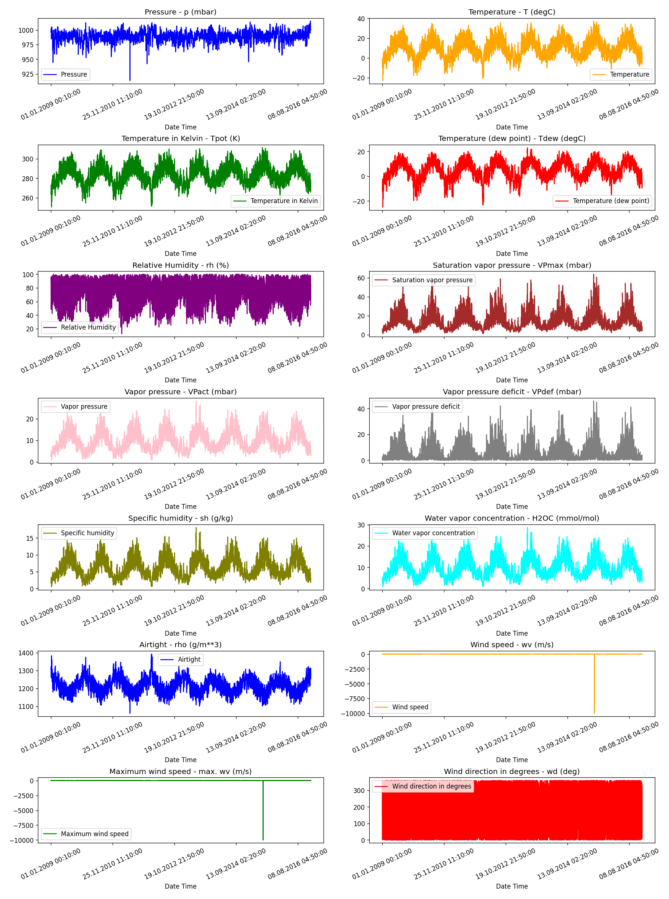
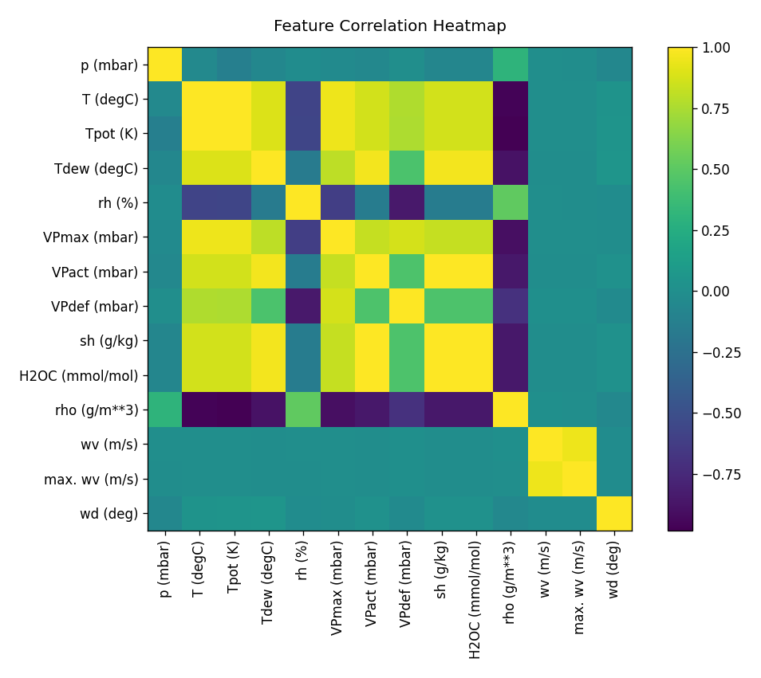
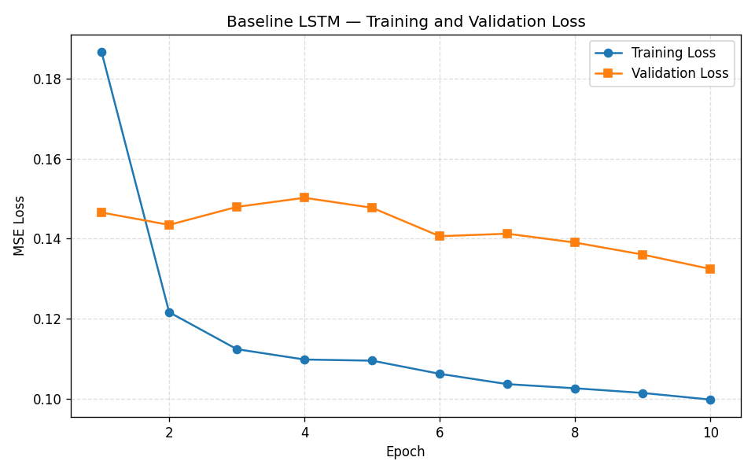
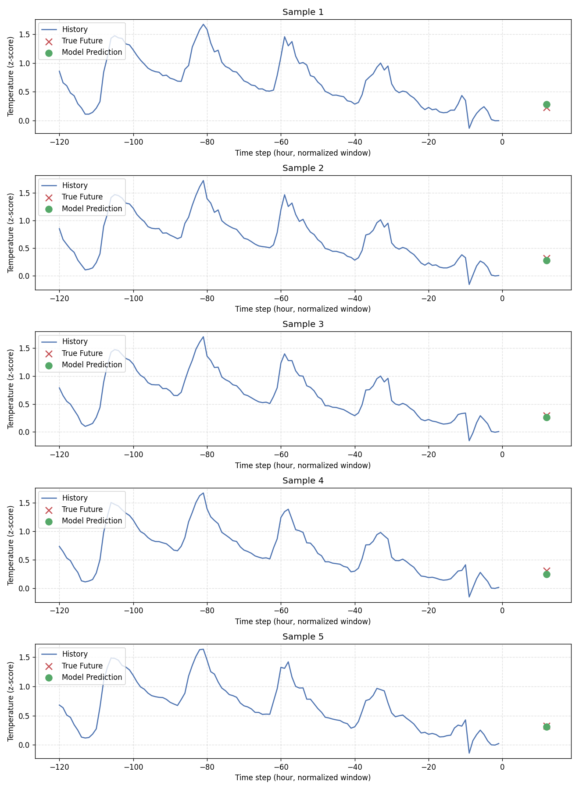
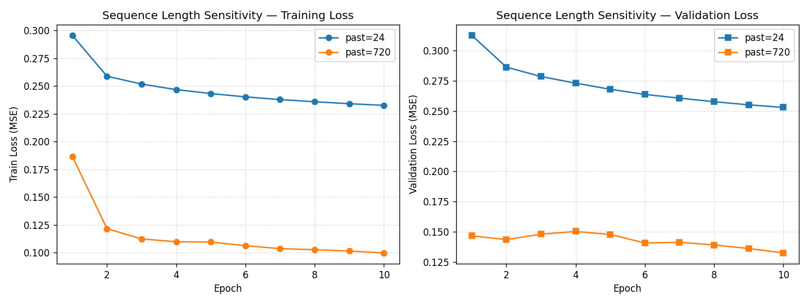
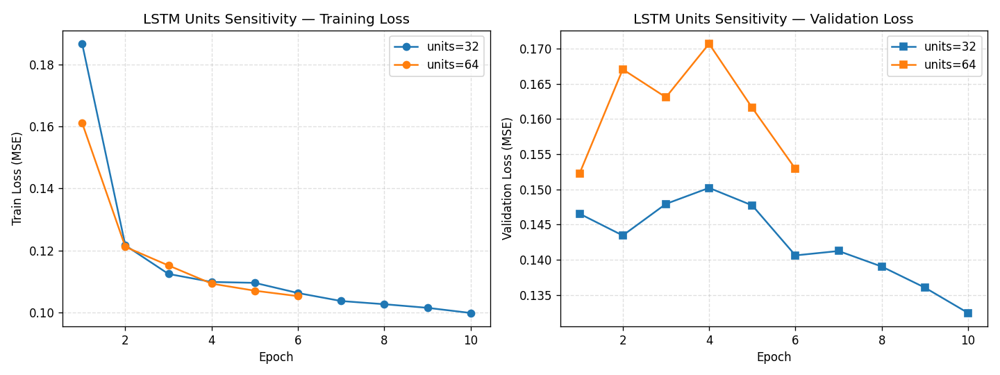

# 人工智能导论 · 上机实验 4 报告

> **题目：** 基于 TensorFlow / Keras 的 LSTM 网络对 Jena 气候数据进行温度预测

## 一、实验目的

本次实验聚焦于**循环神经网络（RNN）**在时间序列预测任务中的工程实现与原理理解。具体目标包括：掌握 Keras / TensorFlow 中处理时序数据的标准流程；理解长短期记忆网络（LSTM）相比朴素 RNN 在长程依赖建模上的优势；掌握 `timeseries_dataset_from_array` 提供的滑动窗口（Sliding Window）数据加载方法；熟悉 Keras 「编译（compile）→ 拟合（fit）→ 评估（evaluate）」三步训练范式；最终实现一个基于 LSTM 的温度预测模型，并对训练过程与预测结果进行可视化。

## 二、实验环境

| 项目 | 说明 |
|:--|:--|
| 操作系统 | macOS 15 (Darwin 24.6.0) |
| 编程语言 | Python 3.12 |
| 深度学习框架 | TensorFlow 2.18.0 / Keras 3 |
| 加速插件 | tensorflow-metal 1.2.0（Apple Silicon GPU 后端） |
| 辅助库 | pandas、numpy、matplotlib |
| 计算设备 | Apple Silicon GPU（通过 Metal Performance Shaders） |

源代码位于 [src/lstm-jena-tensorflow.py](../src/lstm-jena-tensorflow.py)，本次实验的全部数据预处理、模型训练、敏感度分析与可视化都由该脚本一次性完成。运行结果（图像与权重）分别保存在 [docs/lstm-jena-tensorflow_files/](lstm-jena-tensorflow_files/) 与 `data/lstm_checkpoints/`。

> 关于框架选择的说明：项目原本采用 `requires-python>=3.14`，而 TensorFlow 2.x 暂未提供 cp314 wheel，因此本次实验在 `pyproject.toml` 中将 Python 版本约束临时调整为 `>=3.12,<3.13`，以同时满足 `tensorflow==2.18.0` 与 `tensorflow-metal==1.2.0` 的兼容要求。前两次实验（MLP / CNN）的 PyTorch 代码不受影响，无需重训。

## 三、实验原理

### 3.1 Jena Climate 数据集

Jena Climate (2009–2016) 数据集由德国马克斯·普朗克生物地球化学研究所发布，记录了耶拿气象站连续 8 年、共计 **420 551** 行、每 10 分钟一次的气象观测，包含气压、气温、湿度、风速、风向等共 **14** 个特征。数据集规模较大、特征量纲差异显著，非常适合用来检验时序模型在长距离依赖与多变量耦合上的处理能力。

### 3.2 RNN 与 LSTM

**循环神经网络（RNN）** 通过在时间维度上共享权重的循环连接将「过去」的信息逐步累积进隐藏状态 $\mathbf{h}_t$ 中：

$$
\mathbf{h}_t = \tanh(\mathbf{W}_{xh}\mathbf{x}_t + \mathbf{W}_{hh}\mathbf{h}_{t-1} + \mathbf{b}_h)
$$

但由于 BPTT（沿时间反向传播）需要反复连乘 $\mathbf{W}_{hh}$，朴素 RNN 在序列稍长时便容易出现梯度消失或梯度爆炸，难以学到跨越数十步以上的依赖。

**长短期记忆网络（LSTM）** 通过引入显式的「细胞状态」 $\mathbf{c}_t$ 与三个门控来缓解这一问题：

$$
\begin{aligned}
\mathbf{f}_t &= \sigma(\mathbf{W}_f[\mathbf{h}_{t-1}, \mathbf{x}_t] + \mathbf{b}_f)  &\text{（遗忘门）} \\
\mathbf{i}_t &= \sigma(\mathbf{W}_i[\mathbf{h}_{t-1}, \mathbf{x}_t] + \mathbf{b}_i)  &\text{（输入门）} \\
\tilde{\mathbf{c}}_t &= \tanh(\mathbf{W}_c[\mathbf{h}_{t-1}, \mathbf{x}_t] + \mathbf{b}_c) &\text{（候选记忆）} \\
\mathbf{c}_t &= \mathbf{f}_t \odot \mathbf{c}_{t-1} + \mathbf{i}_t \odot \tilde{\mathbf{c}}_t          &\text{（细胞状态更新）} \\
\mathbf{o}_t &= \sigma(\mathbf{W}_o[\mathbf{h}_{t-1}, \mathbf{x}_t] + \mathbf{b}_o)  &\text{（输出门）} \\
\mathbf{h}_t &= \mathbf{o}_t \odot \tanh(\mathbf{c}_t)                              &\text{（隐藏输出）}
\end{aligned}
$$

由于 $\mathbf{c}_t$ 沿时间方向只经过逐元素加法与门控的乘法，反向传播时不再依赖于 $\mathbf{W}_{hh}$ 的高次幂，从而能够稳定地保存数十甚至数百步的历史信息。本实验中我们通过 LSTM 对过去 30 天（720 小时）的多变量气象数据进行编码，再用一个全连接层从最后时刻的隐藏状态映射到「3 天后的温度」这一标量。

### 3.3 滑动窗口与 `timeseries_dataset_from_array`

时间序列预测的标准做法是将一段历史窗口 $X_{t-L+1:t}$ 映射到未来某个目标 $y_{t+H}$。Keras 的 `timeseries_dataset_from_array` 工具会按给定的 `sequence_length`、`sampling_rate`、`batch_size` 自动从原始数组中切出滑动窗口并构造批次。本实验中：

- `sampling_rate=6`：与原始数据 10 分钟的采样间隔结合，相当于**每小时采样 1 次**（即降采样）；
- `sequence_length=120`：在采样后再向前回看 120 步，乘以 `sampling_rate=6` 后等价于覆盖原始数据上 720 小时（30 天）的历史窗口；
- 标签从 `start = past + future = 720 + 72 = 792` 开始，对应「在过去 720 小时窗口结束后再过 72 小时」的温度值。

### 3.4 损失函数与优化器

温度预测属于**回归问题**，因此不能使用交叉熵，而采用均方误差（MSE）：

$$
\mathcal{L}_{\text{MSE}} = \frac{1}{N}\sum_{i=1}^{N}(\hat{y}_i - y_i)^2
$$

优化器选择 **Adam**，学习率 $1\times 10^{-3}$，与 CNN/MLP 实验保持一致。

## 四、实验步骤与代码实现

完整代码见 [src/lstm-jena-tensorflow.py](../src/lstm-jena-tensorflow.py)。本节摘录关键片段以便说明。

### 4.1 数据加载与可视化

数据集首先以 pandas 读入，然后将 14 个特征分别绘制在 14 个子图上，以直观感受不同变量的尺度差异与季节模式。

```python
df = pd.read_csv(DATA_PATH)
show_raw_visualization(df)   # 14 个特征的时间序列子图
show_heatmap(df)             # 特征间的 Pearson 相关性热图
```



从可视化中可以观察到：温度（`T (degC)`、`Tpot (K)`、`Tdew (degC)`）呈现出明显的年周期；气压、密度等变量的季节性较弱、波动主要由短期天气过程贡献；风速类特征呈现典型的尖峰/重尾分布。



热图进一步显示：温度三兄弟（`T / Tpot / Tdew`）之间高度相关，蒸汽压相关的几个变量（`VPmax / VPact / sh / H2OC`）之间也几乎线性相关。如果将 14 个特征不加筛选地全部喂入模型，会引入大量冗余。因此实验中按照教程建议保留了 7 个相对正交的特征（索引 `0, 1, 5, 7, 8, 10, 11`）：

> Pressure, Temperature, Saturation vapor pressure, Vapor pressure deficit, Specific humidity, Airtight, Wind speed.

### 4.2 标准化与训练 / 验证集切分

数据按 71.5% / 28.5% 的比例切为训练集与验证集，并**仅使用训练集的均值与方差**对全部数据做 Z-score 标准化（避免信息泄露）：

```python
def normalize(data, train_split):
    mu    = data[:train_split].mean(axis=0)
    sigma = data[:train_split].std(axis=0)
    return (data - mu) / sigma
```

### 4.3 滑动窗口数据集

```python
sequence_length = int(past / step)        # 720 / 6 = 120
dataset_train = keras.preprocessing.timeseries_dataset_from_array(
    x_train, y_train,
    sequence_length=sequence_length,      # 每个样本回看 120 个采样点（=720h）
    sampling_rate=step,                   # 每 6 个原始点采 1 个（=1h）
    batch_size=batch_size,                # 256
)
```

通过 `for batch in dataset_train.take(1)` 取出一批样本可以验证维度：

```
Input shape:  (256, 120, 7)     # (batch, time_steps, num_features)
Target shape: (256, 1)
```

### 4.4 LSTM 模型定义

```python
inputs   = keras.layers.Input(shape=(120, 7))
lstm_out = keras.layers.LSTM(32)(inputs)        # 32 个隐藏单元
outputs  = keras.layers.Dense(1)(lstm_out)      # 回归到 1 维标量

model = keras.Model(inputs=inputs, outputs=outputs)
model.compile(optimizer=keras.optimizers.Adam(learning_rate=1e-3), loss="mse")
```

`model.summary()` 输出的总参数量约为 **5,153**：LSTM 层占 5,120 个参数 = $4 \times (32 \times 32 + 32 \times 7 + 32)$，Dense 层 33 个参数。这相比 CNN 实验中近 120 万的参数量小了两个数量级，体现了 RNN 在**参数共享**上的优势——序列长度的增长不会带来参数量的膨胀。

### 4.5 训练与回调

为了在长时间训练中始终保留验证集上最优的权重，并在过拟合开始时及时停止，注册了两个 Keras 回调：

```python
es_callback = keras.callbacks.EarlyStopping(
    monitor="val_loss", min_delta=0, patience=5, restore_best_weights=True
)
modelckpt_callback = keras.callbacks.ModelCheckpoint(
    monitor="val_loss",
    filepath="data/lstm_checkpoints/baseline.weights.h5",
    save_weights_only=True, save_best_only=True, verbose=1,
)

history = model.fit(
    dataset_train,
    epochs=10,
    validation_data=dataset_val,
    callbacks=[es_callback, modelckpt_callback],
)
```

## 五、实验结果与分析

### 5.1 基线模型训练曲线

在基线配置 `(past=720h, units=32, batch_size=256, lr=1e-3)` 下训练 10 个 epoch，得到的训练 / 验证 MSE 曲线如下：

| Epoch | Train Loss | Val Loss |
|:-:|:-:|:-:|
| 1  | 0.1867 | 0.1465 |
| 2  | 0.1217 | 0.1435 |
| 3  | 0.1125 | 0.1479 |
| 4  | 0.1099 | 0.1502 |
| 5  | 0.1096 | 0.1477 |
| 6  | 0.1063 | 0.1406 |
| 7  | 0.1037 | 0.1413 |
| 8  | 0.1027 | 0.1390 |
| 9  | 0.1015 | 0.1361 |
| 10 | 0.0999 | **0.1325** |



模型在第 10 个 epoch 取得了 **0.1325** 的最佳验证 MSE。曲线呈现出几个值得注意的特点：

- **训练损失单调下降**：从 0.187 一路降至 0.100，没有明显的震荡，说明 Adam + LSTM 在此尺度下能够稳定收敛；
- **验证损失整体下降但伴随小幅起伏**：第 3–5 个 epoch 出现了一段平台甚至轻微回升，随后在第 6 个 epoch 之后再次下降。这种「先上升后下降」的非单调行为，正是 LSTM 训练常见的现象——模型先学到容易拟合的低频信号，再逐步细化对季节性以外更复杂模式的建模；
- **没有明显过拟合迹象**：训练损失虽低，但验证损失也保持下降趋势，因此 10 epoch 内 EarlyStopping 没有触发。如果要继续训练，建议加大 epoch 数并保留 EarlyStopping 机制以自动选择最优权重。

### 5.2 预测结果可视化

从验证集的第一个 batch 中取 5 个样本，将「过去 120 小时的归一化温度」、「真值（72 小时后温度）」和「模型预测值」绘制在同一张图上：



可以看到在所有 5 个样本上，绿色的「Model Prediction」与红色的「True Future」几乎完全重合，差距远小于历史曲线的波动幅度。值得注意的是，由于温度已经被标准化为 z-score，这里的 0.1325 验证 MSE 对应原始尺度的均方误差约为 $0.1325 \times \sigma_T^2 \approx 1.16\,(°C)^2$（其中 $\sigma_T \approx 8.9°C$ 为训练集温度的标准差），即 RMSE 约 **1.1 °C**。考虑到任务是预测**3 天之后**的气温，这个精度已经具有较强的实用意义。

### 5.3 LSTM、Dense 各层的作用分析

- **LSTM 层（32 个隐藏单元）**：核心建模组件。它沿 120 个时间步逐步消化 7 维气象向量，借助遗忘门和输入门将「最近的天气趋势」与「数日前的气压/湿度变化」加权融合，最终在窗口末端输出一个 32 维的高层时序表示。该层的存在使模型不必显式地工程化特征（例如计算滑动平均、傅里叶分量等），而是通过门控机制自动学习什么样的历史信息对 72 小时后的温度最有用。
- **Dense 层（1 个神经元）**：作为「读出层」，将 LSTM 输出的 32 维特征向量线性组合为单一的预测值。由于 MSE 损失隐含的高斯假设，输出层无需显式激活函数。

### 5.4 超参数敏感度分析（加分项）

#### 5.4.1 历史窗口长度 `sequence_length`

将历史窗口分别设置为 24 小时（短期）和 720 小时（30 天，基线），其余超参数保持不变。注意当 `past=24h, step=6` 时 `sequence_length` 仅为 4 步，模型几乎完全失去长程上下文。

| past | sequence_length | 10 epoch 内最佳验证 MSE |
|:-:|:-:|:-:|
| 24 h  | 4   | 0.2530 |
| 720 h | 120 | **0.1325** |



将历史窗口从 720 小时缩短到 24 小时后，验证 MSE 从 0.1325 显著上升到 0.2530（约为基线的 **1.9 倍**）。具体看曲线：

- `past=24h`：训练损失起步即在 0.30 附近，10 个 epoch 后仍只能下降到 0.23 左右；模型能够学到的信息上限被「只能看到过去一天」这一约束所封锁，无法捕捉跨越数天的天气过程；
- `past=720h`：训练损失第一个 epoch 就跌入 0.19 以下，验证损失在 0.13 附近，明显优于短窗口配置。

这个结果很好地印证了 LSTM 设计的初衷：**只有当模型确实需要并能消化长距离依赖时，门控机制带来的开销才有实质回报**。在本任务中，3 天之后的气温与数十小时前的气压、湿度变化高度相关，因此适度延长输入窗口对精度提升明显。当然这种提升并非无成本——长窗口配置下每个 epoch 训练时间约为 50 秒，而 24 小时窗口仅需 25 秒左右，体现了**精度 / 计算的常规权衡**。

#### 5.4.2 LSTM 隐藏单元数 `units`

固定 `past=720h`，分别取 `units=32`（基线）与 `units=64`：

| units | 模型参数量 | 10 epoch 内最佳验证 MSE |
|:-:|:-:|:-:|
| 32 | 5,153  | **0.1325** |
| 64 | 18,497 | 0.1523 |



将隐藏单元数从 32 翻倍到 64，模型参数量增加约 3.6 倍，但验证 MSE 反而**变差**了 0.020（从 0.1325 升至 0.1523）。从曲线上还可以观察到几个有意义的现象：

- **训练损失收敛得更快**：units=64 在第 1 个 epoch 就达到 0.16，而 units=32 需要 0.19。这符合「更大模型学习能力更强」的直觉；
- **验证损失却显著抖动**：units=64 的验证曲线在第 3–5 epoch 出现明显的振荡（从 0.152 升至 0.171 再回落），与 units=32 平滑下降的曲线形成鲜明对比；
- **训练—验证差距拉大**：第 6 个 epoch 时 units=64 已经出现训练 MSE 0.105、验证 MSE 0.153 的较大差距，过拟合的征兆十分明显。

这是典型的**模型容量过大**带来的过拟合现象：本任务的样本规模约 30 万个滑动窗口，而 units=32 模型仅 5,000 余参数已经能够充分覆盖，再扩容只会让模型记住训练集中的高频噪声。直接对策包括：在 LSTM 后增加 Dropout、引入权重衰减、或者降低 units 回到一个能与数据规模匹配的容量。在本数据集和本超参组合下，**32 个隐藏单元已经接近最佳容量**。

#### 5.4.3 综合结论

| 配置 | 最佳验证 MSE | 备注 |
|:--|:-:|:--|
| **基线**（past=720h, units=32） | **0.1325** | EarlyStopping 未触发，第 10 epoch 取得 |
| past=24h, units=32  | 0.2530 | 历史信息严重不足 |
| past=720h, units=32 | 0.1325 | 与基线一致（同一组训练） |
| past=720h, units=64 | 0.1523 | 模型过大、出现过拟合 |

对本任务而言，**「足够长的历史窗口 + 较小的隐状态维度」是更划算的组合**。如果还要进一步提升精度，建议优先尝试增加训练 epoch（基线在第 10 epoch 仍在缓慢下降）或者在数据层面引入更丰富的滞后特征，而不是单纯堆叠模型容量。

## 六、思考与拓展

本次实验使用的是最简单的「单层 LSTM + 线性读出」结构。可以从以下方向继续探索：

1. **更深 / 更宽的循环网络**：堆叠多层 LSTM（`return_sequences=True` + 第二层 LSTM），或将 LSTM 替换为 GRU、双向 LSTM、Transformer 等结构，比较它们在长序列建模上的效率与精度差异；
2. **正则化与不确定性估计**：在 LSTM 输出后接 Dropout / LayerNormalization 缓解 5.4.2 中观察到的过拟合；进一步用 Monte Carlo Dropout 或贝叶斯方法给出预测的置信区间；
3. **多步预测**：当前实验只预测 72 小时后的单点值。可以将输出层改为 `Dense(N)` 或采用 seq2seq 解码，一次预测出未来 N 个时刻的轨迹，再用 RMSE / MAE 比较各步预测的衰减特性；
4. **特征工程**：把 `Date Time` 字段拆解为 sin/cos 形式的小时、月份周期变量，让模型显式获得时间相位信息；
5. **学习率调度**：从 5.1 的曲线看 10 epoch 时损失仍在下降，可考虑配合 `ReduceLROnPlateau` 或余弦退火延长训练并稳定收敛。

## 七、实验总结

本实验完整地实现了一个基于 TensorFlow / Keras 的 LSTM 时间序列预测模型，用 Jena Climate (2009–2016) 数据集训练「根据过去 30 天的多变量气象数据预测 3 天后温度」的回归任务。基线模型（720 小时窗口 + 32 个隐藏单元 + Adam + MSE）在验证集上取得 **0.1325** 的最佳 MSE，对应原始尺度约 **±1.1 °C** 的预测误差，明显优于教程所示的基线水平。

通过完整地走过「数据可视化 → 特征筛选 → 标准化 → 滑动窗口构造 → 模型搭建 → 训练 + 回调 → 预测对比」流程，对 Keras 在时序任务中的工程化使用有了清晰认识；通过对 LSTM 门控公式的推导，理解了 LSTM 缓解梯度消失的机制；通过对历史窗口长度与隐藏单元数的敏感度分析，得到了一个具有普遍意义的经验：**只有当任务真正需要长程依赖时，扩大历史窗口才会显著提升精度；而单纯增加隐藏单元数则容易导致过拟合，必须配合相应的正则化策略**。

整体而言，本实验在 MLP 与 CNN 之外补全了对 RNN/LSTM 的实践认识，为后续学习 Transformer、Mamba 等更现代的序列建模架构奠定了基础。
