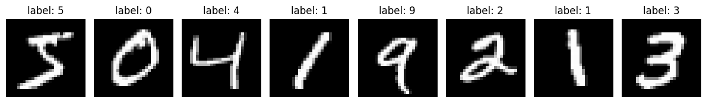
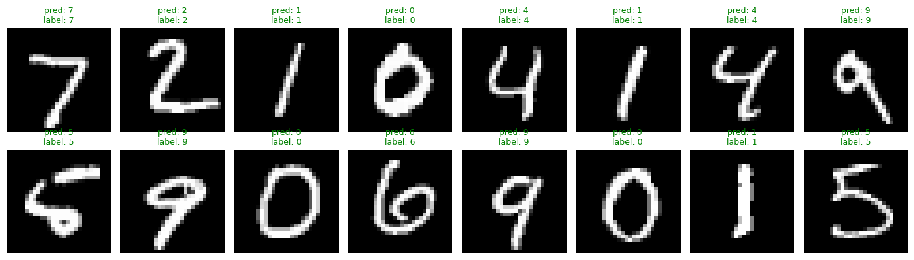

# 人工智能导论 · 上机实验 1-2 报告

> **题目：** 基于 PyTorch 的多层感知机（MLP）识别 MNIST 数据集

## 一、实验目的

本次实验的主要目的是学习使用 PyTorch 进行深度学习模型的设计和训练，并通过具体实现一个多层感知机（MLP）分类器，熟悉数据加载、模型构建、训练与评估的完整流程。在此基础上，进一步了解深度学习中常见的调优方法，例如参数初始化方式、优化器的选择、损失函数的设计，以及正则化策略对模型泛化能力的影响，从而为后续更复杂的深度学习模型打下基础。

## 二、实验环境

| 项目 | 说明 |
|:--|:--|
| 操作系统 | macOS |
| 编程语言 | Python 3.14 |
| 深度学习框架 | PyTorch 2.11.0 |
| 辅助库 | torchvision、matplotlib、numpy |
| 计算设备 | Apple Silicon GPU (MPS) |

## 三、实验原理

### 3.1 MNIST 数据集

MNIST 是手写数字识别的经典数据集，由 60000 张训练图像和 10000 张测试图像组成，每张图像是 $28 \times 28$ 的灰度图，对应一个 0–9 的数字标签。由于样本规模适中、类别平衡，它常被用作入门级的图像分类基准。

### 3.2 多层感知机（MLP）

多层感知机是一种最基础的前馈神经网络。它由若干个全连接层（Linear layer）堆叠而成，层与层之间通过非线性激活函数连接。对于一层全连接，其计算公式为：

$$
\mathbf{h} = \sigma(\mathbf{W}\mathbf{x} + \mathbf{b})
$$

其中 $\mathbf{W}$ 是权重矩阵，$\mathbf{b}$ 是偏置向量，$\sigma(\cdot)$ 是激活函数。通过堆叠多层这样的结构，网络能够学习到输入到输出的非线性映射。

本实验采用的网络结构如下：

$$
784 \xrightarrow{\text{FC+ReLU}} 256 \xrightarrow{\text{FC+ReLU}} 128 \xrightarrow{\text{FC}} 10
$$

即先将 $28 \times 28$ 的图像展平成 784 维向量，再经过两个带 ReLU 激活的隐藏层，最后输出 10 个类别的分数（logits）。

### 3.3 激活函数：ReLU

ReLU（修正线性单元）定义为：

$$
\mathrm{ReLU}(x) = \max(0, x)
$$

相比 Sigmoid 和 Tanh，ReLU 计算简单、不容易出现梯度消失，因此在深度网络中被广泛使用。

### 3.4 损失函数：交叉熵

对于多分类任务，使用交叉熵损失（Cross-Entropy Loss）。给定样本的 logits $\mathbf{z}$ 和真实类别 $y$，损失为：

$$
\mathcal{L} = -\log \frac{e^{z_y}}{\sum_{k=1}^{K} e^{z_k}}
$$

PyTorch 的 `nn.CrossEntropyLoss` 内部已经集成了 Softmax 和取对数的运算，因此网络输出层不需要再加 Softmax，直接输出 logits 即可。

### 3.5 优化器：Adam

Adam 优化器是对 SGD 的改进，结合了动量和自适应学习率的思想。它对学习率的选择不敏感，通常比纯 SGD 收敛得更快，是目前最常用的优化器之一。本实验使用默认学习率 $10^{-3}$。

## 四、实验步骤与代码实现

### 4.1 导入依赖并选择设备


```python
# 导入必要的库
import torch
from torch import nn
import torch.optim as optim
import torch.utils.data as Data
import torchvision
import torchvision.transforms as transforms

# 设置随机种子以确保结果可重现
torch.manual_seed(1)

# 选择训练设备：有 GPU 就用 GPU，没有就用 CPU
device: torch.device = torch.device(
    "cuda"
    if torch.cuda.is_available()
    else "mps"
    if torch.backends.mps.is_available()
    else "cpu"
)
print("PyTorch 版本:", torch.__version__)
print("使用设备:", device)
```

    PyTorch 版本: 2.11.0
    使用设备: mps


这里按照 `cuda → mps → cpu` 的顺序选择设备，保证代码在不同机器上都能运行。

### 4.2 加载并预处理 MNIST 数据集

在将样本送入网络之前，需要对原始图像进行预处理。首先通过 `ToTensor()` 把 PIL 图像转换为 Tensor，并将像素值从 $[0, 255]$ 线性缩放到 $[0, 1]$ 区间；随后调用 `Normalize()`，按照 MNIST 训练集的均值 0.1307 和标准差 0.3081 进行标准化，使每一维输入大致服从均值为 0、方差为 1 的分布。经过标准化后的数据在数值尺度上更加一致，可以避免不同维度之间量级差异过大所导致的梯度失衡问题，从而加快模型的训练收敛速度。


```python
# 定义数据预处理：将 PIL 图像转换为 Tensor，并归一化到 [-1, 1]
# MNIST 训练集的均值约为 0.1307，标准差约为 0.3081
transform = transforms.Compose(
    [
        transforms.ToTensor(),  # PIL Image -> Tensor, 像素从 [0,255] 缩放到 [0,1]
        transforms.Normalize((0.1307,), (0.3081,)),  # 按均值/标准差做归一化
    ]
)

# 下载并加载训练集
mnist_train = torchvision.datasets.MNIST(
    root="../data",  # 数据存放目录
    train=True,  # 训练集
    download=True,  # 若本地没有则自动下载
    transform=transform,  # 应用预处理
)

# 下载并加载测试集
mnist_test = torchvision.datasets.MNIST(
    root="../data",
    train=False,  # 测试集
    download=True,
    transform=transform,
)

print(f"训练集样本数: {len(mnist_train)}")
print(f"测试集样本数: {len(mnist_test)}")

# 查看单张图像的形状和标签
image, label = mnist_train[0]
print(f"图像张量形状: {image.shape}  (通道, 高, 宽)")
print(f"标签: {label}")
```

    训练集样本数: 60000
    测试集样本数: 10000
    图像张量形状: torch.Size([1, 28, 28])  (通道, 高, 宽)
    标签: 5


从输出可以看到，训练集有 60000 张、测试集 10000 张样本，每张图像的张量形状是 $[1, 28, 28]$（通道 × 高 × 宽）。

为了更直观地了解数据，这里取训练集的前 8 张图像进行可视化：


```python
# 可视化几张训练集图像，直观感受数据
import matplotlib.pyplot as plt

fig, axes = plt.subplots(1, 8, figsize=(12, 2))
for i, ax in enumerate(axes):
    img, lbl = mnist_train[i]
    # 反归一化以便显示（仅用于展示）
    ax.imshow(img.squeeze().numpy() * 0.3081 + 0.1307, cmap="gray")
    ax.set_title(f"label: {lbl}")
    ax.axis("off")
plt.tight_layout()
plt.show()
```


​    

​    


可以看到图像是居中的手写数字，书写风格差异较大，但整体上比较清晰。

### 4.3 构建 DataLoader

训练时我们以**小批量（mini-batch）**的方式向网络输入数据。DataLoader 的作用就是把数据集切分成批、打乱顺序、并按需加载。批大小（batch size）设为 128：批太小梯度噪声大、训练不稳定；批太大则占用内存多、且每步更新慢。


```python
# 批量大小：较大的 batch 训练更稳定，但占用更多内存
batch_size: int = 128

train_iter = Data.DataLoader(
    dataset=mnist_train,
    batch_size=batch_size,
    shuffle=True,  # 训练集需要打乱
    num_workers=0,
)

test_iter = Data.DataLoader(
    dataset=mnist_test,
    batch_size=batch_size,
    shuffle=False,  # 测试集不需要打乱
    num_workers=0,
)

# 查看一个 batch 的结构
X: torch.Tensor
y: torch.Tensor
for X, y in train_iter:
    print(f"一个 batch 的图像形状: {X.shape}")  # [batch, 1, 28, 28]
    print(f"一个 batch 的标签形状: {y.shape}")  # [batch]
    break
```

    一个 batch 的图像形状: torch.Size([128, 1, 28, 28])
    一个 batch 的标签形状: torch.Size([128])


每个 batch 的输入形状为 $[128, 1, 28, 28]$，标签为长度 128 的一维向量。

### 4.4 定义 MLP 网络

网络采用两种等价写法：一是通过继承 `nn.Module` 自定义子类；二是使用 `nn.Sequential` 直接堆叠。实际训练中我们使用后者，因为它更简洁。

**注意：** 最后一层输出 10 个 logits，没有加 Softmax。这是因为后面使用的 `nn.CrossEntropyLoss` 已经在内部做了 `LogSoftmax`，如果再手动加一次反而会影响数值稳定性。


```python
# 定义网络结构常量
num_inputs: int = 28 * 28  # 输入维度：784
num_hidden1: int = 256  # 第一隐藏层神经元数
num_hidden2: int = 128  # 第二隐藏层神经元数
num_outputs: int = 10  # 输出类别数


# 方法 1：通过继承 nn.Module 自定义 MLP
class MLP(nn.Module):
    def __init__(self) -> None:
        super(MLP, self).__init__()
        # nn.Flatten 将 [batch, 1, 28, 28] 展平为 [batch, 784]
        self.flatten = nn.Flatten()
        self.hidden1 = nn.Linear(num_inputs, num_hidden1)
        self.hidden2 = nn.Linear(num_hidden1, num_hidden2)
        self.output = nn.Linear(num_hidden2, num_outputs)
        self.relu = nn.ReLU()

    def forward(self, x: torch.Tensor) -> torch.Tensor:
        x = self.flatten(x)
        x = self.relu(self.hidden1(x))
        x = self.relu(self.hidden2(x))
        # 输出未经 softmax 的 logits
        return self.output(x)


# 方法 2：使用 nn.Sequential 构建相同结构（更简洁）
net: nn.Sequential = nn.Sequential(
    nn.Flatten(),
    nn.Linear(num_inputs, num_hidden1),
    nn.ReLU(),
    nn.Linear(num_hidden1, num_hidden2),
    nn.ReLU(),
    nn.Linear(num_hidden2, num_outputs),
)

# 将模型搬到计算设备
net = net.to(device)
print(net)
```

    Sequential(
      (0): Flatten(start_dim=1, end_dim=-1)
      (1): Linear(in_features=784, out_features=256, bias=True)
      (2): ReLU()
      (3): Linear(in_features=256, out_features=128, bias=True)
      (4): ReLU()
      (5): Linear(in_features=128, out_features=10, bias=True)
    )


整个网络一共有约 23.5 万个可学习参数：

$$
(784 \times 256 + 256) + (256 \times 128 + 128) + (128 \times 10 + 10) = 235146
$$

### 4.5 参数初始化

如果不做特殊初始化，网络参数会以默认方式初始化，训练初期可能收敛较慢。这里使用 **Xavier 正态初始化**：它会根据每层输入/输出维度自动设定权重的初始方差，使信号在前向传播中保持稳定。偏置则统一初始化为 0。


```python
from torch.nn import init


def init_weights(m: nn.Module) -> None:
    if isinstance(m, nn.Linear):
        init.xavier_normal_(m.weight)
        init.constant_(m.bias, val=0.0)


# apply 会递归地将该函数应用到每个子模块上
net.apply(init_weights)

# 打印一部分参数，确认初始化已生效
for name, param in net.named_parameters():
    print(name, param.shape)
```

    1.weight torch.Size([256, 784])
    1.bias torch.Size([256])
    3.weight torch.Size([128, 256])
    3.bias torch.Size([128])
    5.weight torch.Size([10, 128])
    5.bias torch.Size([10])


### 4.6 定义损失函数


```python
loss: nn.CrossEntropyLoss = nn.CrossEntropyLoss()
```

### 4.7 定义优化器

使用 Adam 优化器，学习率设为 $10^{-3}$。


```python
lr: float = 1e-3
optimizer: optim.Adam = optim.Adam(net.parameters(), lr=lr)
print(optimizer)
```

    Adam (
    Parameter Group 0
        amsgrad: False
        betas: (0.9, 0.999)
        capturable: False
        decoupled_weight_decay: False
        differentiable: False
        eps: 1e-08
        foreach: None
        fused: None
        lr: 0.001
        maximize: False
        weight_decay: 0
    )


### 4.8 定义评估函数

评估时需要做两件事：(1) 调用 `net.eval()` 将网络切换到评估模式；(2) 用 `torch.no_grad()` 关闭梯度计算，以节省显存并加快推理。评估完后再切回训练模式 `net.train()`。


```python
def evaluate_accuracy(data_iter: Data.DataLoader, net: nn.Module) -> float:
    net.eval()
    correct: int = 0
    total: int = 0
    with torch.no_grad():
        for X, y in data_iter:
            X = X.to(device)
            y = y.to(device)
            # argmax(dim=1) 取每个样本得分最高的类别作为预测
            y_hat: torch.Tensor = net(X).argmax(dim=1)
            correct += (y_hat == y).sum().item()
            total += y.numel()
    net.train()
    return correct / total
```

### 4.9 训练模型

一次完整的训练迭代通常包含五个基本步骤。首先进行**前向传播**，将输入样本经由网络得到预测输出；随后根据预测值与真实标签计算**损失**，衡量当前模型的拟合程度。由于 PyTorch 在反向传播时默认会在已有梯度上进行累加，因此在每次反向传播之前必须先调用 `optimizer.zero_grad()` 进行**梯度清零**，以免不同批次之间相互干扰。紧接着通过自动微分机制完成**反向传播**，求得所有可学习参数的梯度。最后，由优化器根据梯度执行**参数更新**，完成一次迭代。本实验中共训练 10 个 epoch，每一个 epoch 结束后都会在测试集上评估一次准确率，以观察模型在训练过程中的泛化表现。


```python
num_epochs: int = 10

for epoch in range(1, num_epochs + 1):
    net.train()
    train_loss_sum: float = 0.0  # 累计损失
    train_acc_sum: int = 0  # 累计预测正确的样本数
    n: int = 0  # 累计样本数

    for X, y in train_iter:
        X = X.to(device)
        y = y.to(device)

        # 前向传播
        y_hat: torch.Tensor = net(X)
        # 计算损失
        batch_loss: torch.Tensor = loss(y_hat, y)

        # 梯度清零
        optimizer.zero_grad()
        # 反向传播
        batch_loss.backward()
        # 更新参数
        optimizer.step()

        # 统计：损失乘以 batch 大小便于后续求平均
        train_loss_sum += batch_loss.item() * y.shape[0]
        train_acc_sum += (y_hat.argmax(dim=1) == y).sum().item()
        n += y.shape[0]

    test_acc: float = evaluate_accuracy(test_iter, net)
    print(
        f"epoch {epoch:2d}, "
        f"loss {train_loss_sum / n:.4f}, "
        f"train acc {train_acc_sum / n:.4f}, "
        f"test acc {test_acc:.4f}"
    )
```

    epoch  1, loss 0.2263, train acc 0.9312, test acc 0.9679
    epoch  2, loss 0.0916, train acc 0.9718, test acc 0.9713
    epoch  3, loss 0.0605, train acc 0.9810, test acc 0.9751
    epoch  4, loss 0.0464, train acc 0.9852, test acc 0.9777
    epoch  5, loss 0.0326, train acc 0.9891, test acc 0.9788
    epoch  6, loss 0.0261, train acc 0.9914, test acc 0.9757
    epoch  7, loss 0.0241, train acc 0.9918, test acc 0.9777
    epoch  8, loss 0.0206, train acc 0.9927, test acc 0.9778
    epoch  9, loss 0.0212, train acc 0.9926, test acc 0.9776
    epoch 10, loss 0.0165, train acc 0.9942, test acc 0.9790


## 五、实验结果与分析

### 5.1 训练结果汇总

整理每个 epoch 的训练损失、训练准确率和测试准确率如下表：

| Epoch | 训练损失 | 训练准确率 | 测试准确率 |
|:-:|:-:|:-:|:-:|
| 1  | 0.2263 | 93.12% | 96.79% |
| 2  | 0.0916 | 97.18% | 97.13% |
| 3  | 0.0605 | 98.10% | 97.51% |
| 4  | 0.0464 | 98.52% | 97.77% |
| 5  | 0.0326 | 98.91% | 97.88% |
| 6  | 0.0261 | 99.14% | 97.57% |
| 7  | 0.0241 | 99.18% | 97.77% |
| 8  | 0.0206 | 99.27% | 97.78% |
| 9  | 0.0212 | 99.26% | 97.76% |
| 10 | 0.0165 | 99.42% | **97.90%** |

最终模型在 MNIST 测试集上达到 **97.90%** 的准确率。

### 5.2 结果分析

从训练日志可以看出，模型的收敛速度相当迅速——仅在第 1 个 epoch 结束后，测试准确率就已经达到 96.79%，这体现出 Adam 优化器与 Xavier 正态初始化相结合的良好效果。随着训练的继续进行，训练损失持续下降，训练准确率稳步提升至约 99.4%；然而测试准确率从第 5 个 epoch 起便基本稳定在 97.8% 附近，不再出现明显的上升。训练准确率与测试准确率之间约 1.5% 的差距表明，模型已经开始出现一定程度的过拟合，即网络在训练集上学习到了部分特定样本的细节，但这些细节无法完全迁移到未见样本上。针对这一现象，可以考虑在隐藏层后引入 Dropout 层、在优化器中设置权重衰减（weight decay）进行 L2 正则化，或者采用提前停止（early stopping）策略，在验证集准确率不再提升时终止训练，从而在一定程度上缓解过拟合并提升模型的泛化能力。

### 5.3 预测结果可视化

为了直观感受模型的预测效果，从测试集中取一个 batch 展示 16 张图像。预测正确的用绿色标题，预测错误的用红色标题：


```python
net.eval()
X, y = next(iter(test_iter))
X_dev = X.to(device)
with torch.no_grad():
    preds: torch.Tensor = net(X_dev).argmax(dim=1).cpu()

fig, axes = plt.subplots(2, 8, figsize=(14, 4))
for i, ax in enumerate(axes.flat):
    ax.imshow(X[i].squeeze().numpy() * 0.3081 + 0.1307, cmap="gray")
    color = "green" if preds[i].item() == y[i].item() else "red"
    ax.set_title(
        f"pred: {preds[i].item()}\nlabel: {y[i].item()}", color=color, fontsize=9
    )
    ax.axis("off")
plt.tight_layout()
plt.show()
```


​    

​    


从可视化结果来看，模型对大多数样本都能给出正确的预测，这与整体测试准确率 97.9% 一致。

## 六、思考与拓展

在本实验的基础上，还有许多值得进一步探索的方向。在**网络结构**方面，可以尝试调整隐藏层的数量以及每一层神经元的个数，观察模型容量的变化对最终准确率的影响；在**激活函数**方面，可以将 ReLU 替换为 Sigmoid、Tanh、LeakyReLU 等，对比它们在收敛速度和最终精度上的差异。在**优化器**的选择上，可以分别尝试 SGD、SGD+Momentum、Adam 以及 AdamW，绘制它们的损失曲线与准确率曲线以便直观比较；与之相关的还有**学习率**的设定问题，可以手动调节学习率的大小，或者引入 `torch.optim.lr_scheduler` 中的各种调度策略实现学习率衰减。

为了进一步缓解前文所提及的过拟合问题，可以在网络中引入**正则化**手段，例如在隐藏层后加入 `nn.Dropout(p=0.2)`，或者在优化器中设置 `weight_decay` 以施加 L2 正则项。此外，**批大小**也是一个值得研究的超参数，通过比较 batch_size 分别取 32、128、512 时的训练速度、梯度噪声以及最终准确率，可以更深入地理解小批量随机梯度下降的特性。最后，在**模型架构**层面，可以将现有的 MLP 替换为卷积神经网络（如经典的 LeNet-5）。由于卷积网络通过局部连接与权值共享能够有效利用图像的二维空间结构，它在图像分类任务上的表现通常明显优于全连接网络，也是从 MLP 过渡到现代视觉模型的自然一步。

## 七、实验总结

本次实验通过在 MNIST 数据集上训练一个具有两层隐藏层的多层感知机，完整地体验了 PyTorch 深度学习的基本流程：从数据的加载与预处理，到网络结构的搭建、参数初始化、损失函数与优化器的选择，再到训练循环的编写与测试集上的评估。最终模型在 MNIST 测试集上取得了约 **97.9%** 的识别准确率，验证了所采用方法的有效性。

通过本次实验，笔者对深度学习的工作流程有了更加具体的认识。首先，PyTorch 所提供的 `Dataset`、`DataLoader`、`nn.Module` 以及 `optim` 等模块构成了一套结构清晰的深度学习开发范式，使得数据加载、模型定义与训练循环能够以简洁且模块化的方式组织起来。其次，参数初始化、优化器以及损失函数的选择对训练效果都有着显著的影响——合理的初始化与自适应优化器可以显著加快收敛，而交叉熵损失则是多分类任务的天然选择。此外，通过观察训练曲线与测试曲线之间的差距，笔者对过拟合现象及其常见的缓解手段有了更直观的体会。最后需要认识到的是，MLP 虽然作为入门级模型已经能够在 MNIST 上取得较为理想的结果，但由于它无法利用图像本身的二维空间结构，其性能上限明显低于卷积神经网络，这也为后续学习 CNN 等更先进的视觉模型提供了清晰的动机。
